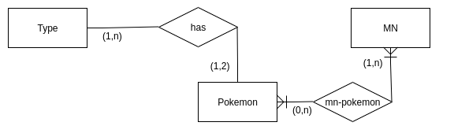

# MyPokedex

MyPokedex aim to create a sqlite database of the data of the first generation of pokemon. Data will be estrapolated from the italian wiki pages.

# 1: Scraping General Data

  - Visit [Pokedex di Kanto wiki list](#%20MyPokedex%20%20MyPokedex%20aim%20to%20create%20a%20sqlite%20database%20of%20the%20data%20of%20the%20first%20generation%20of%20pokemon.%20Data%20will%20be%20estrapolated%20from%20the%20italian%20wiki%20pages.%20%20#%201%20Phase:%20Scraping%20General%20Data!%20%20%20%20-%20Visit%20https://wiki.pokemoncentral.it/Elenco_Pok%C3%A9mon_secondo_il_Pok%C3%A9dex_di_Kanto)
  - Go to [the code for extracting data](./data/parser/crawl_pokedex_list.js "the code for extracting data")
  - Execute the code in the browser console
  - The result is here: [pokedex_list.json](./data/pokedex_list.json "pokedex_list.json")

# 2: Get the MN list and related pokemons
- Similar as in the first step this code will get the mn data and related list one at a time
- Go to every MN page and get the json
- Join in one single file and you will obtain this: [MN_list.json](./data/MN_list.json "MN_list.json")

# 3: Populate database
- Create tables
- Get pokemon list from json and insert to database
- Extract all pokemon types and insert into another table
- Get MN list and insert into database
- Insert in another table the association between the pokemon and the MN if he can learn it

This is done in node.js in the file [app.js](app.js "app.js")

This is the ER of the database:

# RESULT
The generated database is available here: [sqliteDatabase](pokebase.db "sqliteDatabase")
